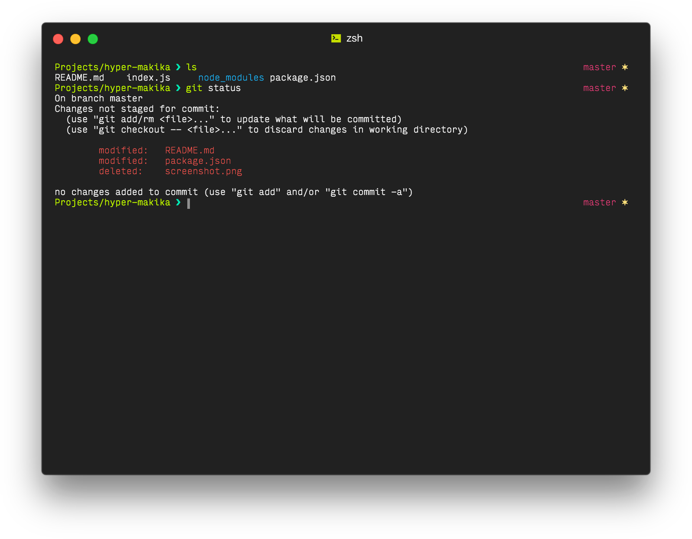

# hyper-makika

> Makika theme for [Hyper.app](https://hyper.is)

## Install

Add `hyper-makika` to the plugins list in your `~/.hyper.js` config file.

## License

ISC © Matt Brennan

Based on [hyperterm-monokai](https://github.com/arkhamdev/hyperterm-monokai) by [Badr Chaouai](http://arkhamdev.com/)
